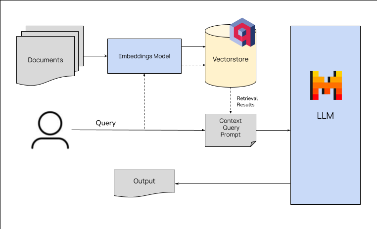

# Chemistry API
## Introduction


## Architecture


## Setup

Create your file ```.env```:
```bash
PORT= # PORT
VECTORDB_PORT= # vectordb port
VECTORDB_URL= # url vectordb:vectordb port
MODEL_NAME= #model name
LLM_API_KEY= #key llm
EMBEDDING_MODEL_NAME= #name embedding model
```
### Docker

To running project by docker:
```
git clone https://github.com/Luke-lab2002/MistralChemistryChatBot.git

cd MistralChemistryChatBot

docker-compose up
```

### Script
To running project by script:

#### Step 1: Install Qdrant vector database:

reference: https://qdrant.tech/documentation/guides/installation/

#### Step 2: Setup Projects
```bash
git clone https://github.com/Luke-lab2002/MistralChemistryChatBot.git

cd MistralChemistryChatBot

pip install -r requirements.txt

python app.py
```

## Add data to vector database
give your data to ```datasets``` in ```vectorDB``` and running ```add_datasets.py```